<h1>Thess Geo Analytics</h1>

Sentinel-2 raster processing pipeline for <b>NDVI time-series analysis</b> and
<b>pixel-level feature extraction</b>.

Developed by <b>Alexandre Rueda Payen</b>.

<h2>Project Goal</h2>

This repository implements a <b>geospatial Earth Observation pipeline</b> that transforms
Sentinel-2 imagery into <b>analysis-ready datasets</b> for temporal analysis and machine learning.

The pipeline produces three main types of outputs:

<ul>
<li>NDVI climatology rasters</li>
<li>NDVI anomaly time series</li>
<li>pixel-level temporal feature stacks</li>
</ul>

The long-term objective is to detect <b>clusters of pixels with similar temporal behaviour</b>.
These clusters may correspond to:

<ul>
<li>environmental disturbances</li>
<li>disaster impact</li>
<li>urbanization</li>
<li>vegetation recovery</li>
<li>ecosystem resilience or sensitivity</li>
</ul>

The final goal is to use these features as input to <b>machine learning models</b>
capable of detecting spatial patterns and changes in land dynamics.

<h2>Study Region</h2>

The current implementation focuses on:

<ul>
<li><b>Thessaloniki (Greece)</b></li>
</ul>

Future extensions are planned for:

<ul>
<li><b>Halkidiki</b></li>
</ul>

Current constraints:

<ul>
<li>The pipeline currently accepts <b>one NUTS level 3 region</b> as input</li>
<li>Thessaloniki AOI size: <b>~X km²</b></li>
</ul>

<h2>Quick Start (Recommended: Docker)</h2>

The pipeline is easiest to run using <b>Docker</b>.
This avoids dependency issues related to GDAL, Rasterio, and other geospatial libraries.

Recommended version : 2.0.0 (see latest release)

<h3>1. Build the Docker Image</h3>

<pre>
docker build -t thess-geo-analytics:2.0.0 .
</pre>

Typical image size:

<pre>
~2.5 GB
</pre>

<h3>2. Prepare the <code>.env</code> File</h3>

The pipeline requires credentials for the satellite data services used during scene retrieval.
Create a <code>.env</code> file at the root of the project and store the required secrets there.

Example:

<pre>
SH_CLIENT_ID=xxxx
SH_CLIENT_SECRET=xxxx

CDSE_USERNAME=xxxx
CDSE_PASSWORD=xxxx
</pre>

Where:

<ul>
<li><b>SH_CLIENT_ID / SH_CLIENT_SECRET</b> — Sentinel Hub credentials</li>
<li><b>CDSE_USERNAME / CDSE_PASSWORD</b> — Copernicus Data Space Ecosystem credentials</li>
</ul>

When running the container, this file is mounted read-only and also passed through
<code>--env-file</code>.

<h3>3. Run the Pipeline</h3>

<pre>
docker run -it --rm `
  -v "C:\...\DATA_LAKE:/data_lake" `
  -v "C:\...\aoi:/app/aoi" `
  -v "C:\...\outputs:/app/outputs" `
  -v "C:\...\config:/app/config:ro" `
  -v "C:\...\ .env:/app/.env:ro" `
  --env-file "C:\...\ .env" `
  -e DATA_LAKE=/data_lake `
  -e PIPELINE_CONFIG=config/pipeline.thess.yaml `
  -e THESS_GEO_ROOT=/app `
  thess-geo-analytics:2.0.0
</pre>

Mounted directories typically include:

<ul>
<li><b>DATA_LAKE</b> — raw Sentinel-2 assets and intermediate rasters</li>
<li><b>aoi</b> — AOI geometries and masks</li>
<li><b>outputs</b> — generated rasters, tables, and preview figures</li>
<li><b>config</b> — pipeline configuration files</li>
<li><b>.env</b> — secrets and provider credentials</li>
</ul>

<h2>Running the Pipeline</h2>

<h3>Run a Decoy Pipeline (Mocked Integration Test) (~3 minutes)</h3>

<pre>
python -m unittest tests.auto.integration.test_WholePipelineTest -v
</pre>

<h3>Run the Full Pipeline (~4 hours)</h3>

<pre>
make full
</pre>

<h3>Run Individual Steps</h3>

<pre>
make help
</pre>

<h2>Visualizing Results</h2>

The repository includes a visualization utility that generates preview images
from the produced rasters.

<pre>
make visualize
</pre>

This reads rasters from:

<pre>
outputs/cogs/
</pre>

and exports PNG previews to:

<pre>
docs/
</pre>

<h2>Runtime Characteristics</h2>

<ul>
<li>Typical runtime: <b>~4 hours</b></li>
<li>Docker image size: <b>~2.5 GB</b></li>
<li>Pipeline disk usage: <b>~20 GB</b></li>
<li>Recommended free disk space: <b>≥ 50 GB</b></li>
</ul>

<h2>Memory Management</h2>

Memory usage is limited using a WSL2 configuration file:

<pre>
[wsl2]
memory=3GB
processors=2
swap=8GB
</pre>

Typical Sentinel-2 scene size:

<pre>
~150 MB
</pre>

The pipeline never loads more than <b>four scenes simultaneously</b>,
keeping memory usage below roughly:

<pre>
~600 MB
</pre>

Processing relies on block-wise raster operations to avoid loading entire rasters into RAM.

<h2>Normalized Difference Vegetation Index (NDVI)</h2>

NDVI is one of the most widely used vegetation indicators in Earth Observation.
It compares near-infrared reflectance and red reflectance to estimate vegetation
density and vegetation activity.

<b>NDVI = (NIR − RED) / (NIR + RED)</b>

For Sentinel-2 imagery:

<ul>
<li><b>B08</b> — Near Infrared (NIR)</li>
<li><b>B04</b> — Red</li>
</ul>

<h3>Observed NDVI Limitations</h3>

During analysis it was observed that some non-vegetated surfaces such as water bodies
and dense urban areas occasionally exhibited slightly positive NDVI values.

Possible causes include:

<ul>
<li>mixed pixels at coarse spatial resolution</li>
<li>surface reflectance noise</li>
<li>atmospheric correction artefacts</li>
<li>subpixel vegetation or algae presence</li>
</ul>

To validate the NDVI computation itself, a synthetic reconstruction test was implemented.

<pre>
tests.auto.unit.test_NdviReconstructionFromSyntheticBandsTest
</pre>

This test reconstructs NDVI values from synthetic red and NIR bands to ensure
the NDVI processor correctly computes the index.

<h2>Pipeline Parameters</h2>

The experiment described in this repository was run using the following configuration:

<pre>
mode: "deep"
debug: false

region: "Thessaloniki"
aoi_id: "el522"

pipeline:
  date_start: "2023-01-01"

raster:
  resolution: 20

scene_catalog:
  cloud_cover_max: 20.0
  max_items: 3000
  full_cover_threshold: 0.95
  n_anchors: 18
  window_days: 21
  collection: "sentinel-2-l2a"

ndvi_composites:
  min_scenes_per_month: 2
  fallback_to_quarterly: true
  strategy: "monthly"
  cloud_masking: true
</pre>

These parameters control:

<ul>
<li>scene filtering thresholds</li>
<li>temporal sampling density</li>
<li>cloud filtering</li>
<li>NDVI compositing strategy</li>
<li>output raster resolution</li>
</ul>

These parameters resulted in:

<ul>
<li><b>14 Sentinel-2 scenes</b> downloaded</li>
<li>Scenes filtered by <b>cloud cover and AOI completeness</b></li>
<li>Images <b>downscaled to 20 m resolution</b></li>
<li><b>11 quarterly NDVI rasters</b> generated</li>
</ul>

<h2>Example Results and Visual Analysis</h2>

The following figures illustrate the intermediate and final outputs produced by the pipeline.

<h2>NDVI Climatology Maps</h2>

These maps represent the <b>median NDVI value</b> observed for each season
(quarter of the year). The median is used instead of the mean because it is
more robust to outliers such as residual cloud contamination or atmospheric noise.

<h3>Q1</h3>
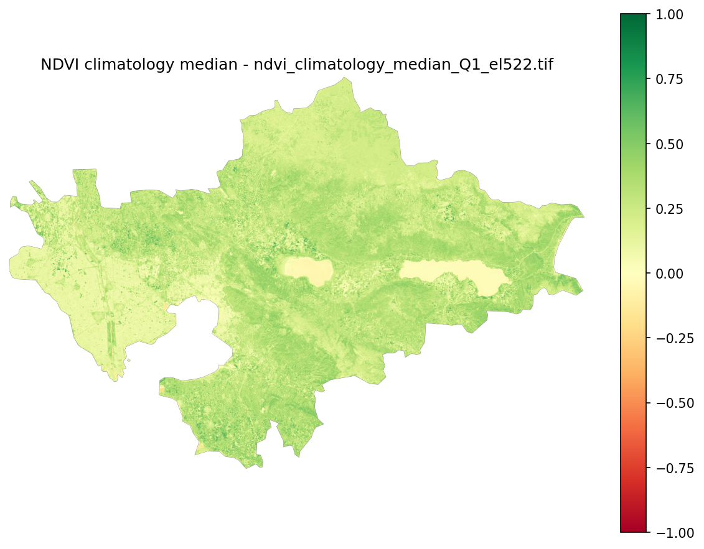

We can see the body of water (Limni Volvi and Periferiaki zoni B) having an NDVI close to 0.00.
Chortiatis mountain area and the Axios Delta show relatively low values, while some agricultural
areas around Perea appear slightly higher.

<h3>Q2</h3>
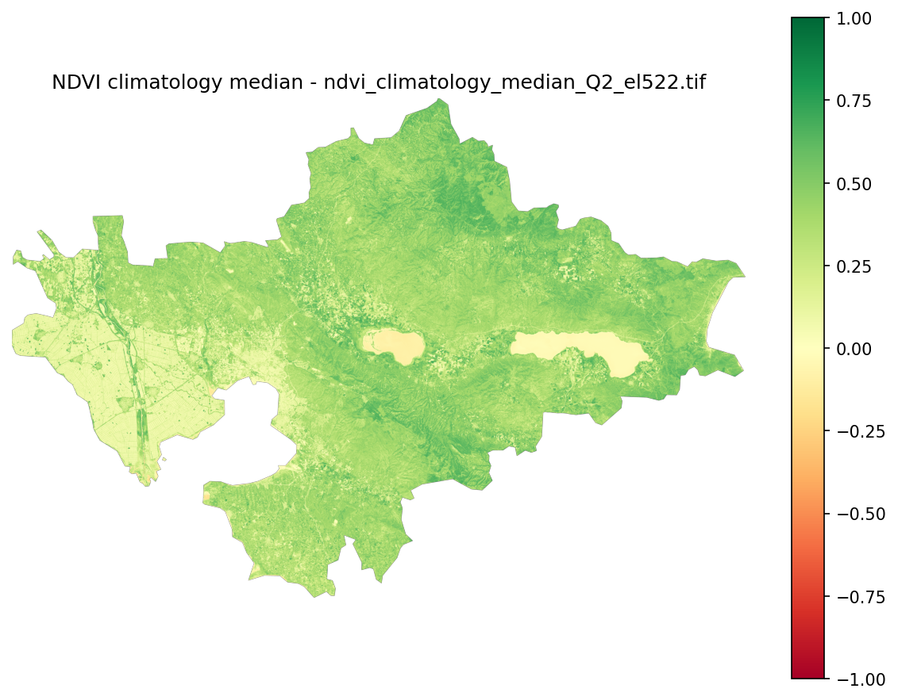

Vegetation remains relatively low around the Axios Delta but increases strongly in Chortiatis.
This is consistent with spring conditions.

<h3>Q3</h3>
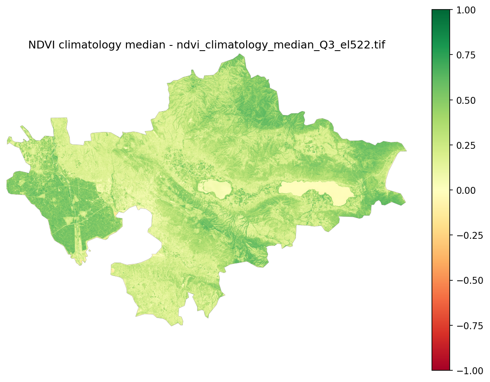

The dry season begins. The Perea subregion becomes substantially less vegetated,
while Chortiatis remains high.

<h3>Q4</h3>
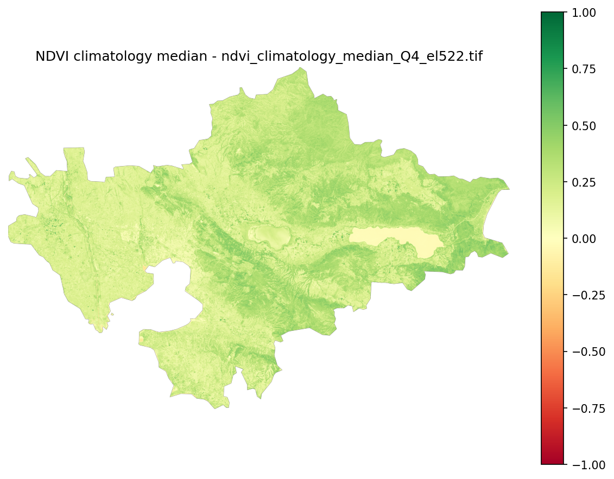

Vegetation decreases across most of the AOI as winter approaches.

<h2>NDVI Anomaly Time Series</h2>

<b>NDVIanomaly = NDVIobserved − NDVIclimatology</b>

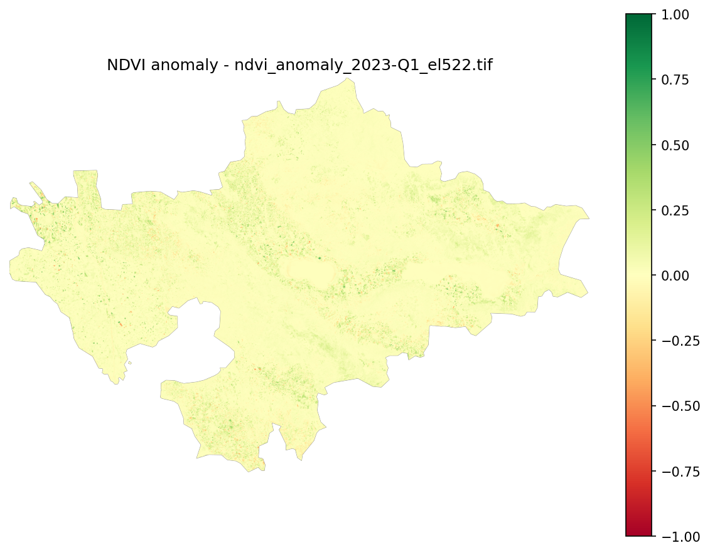

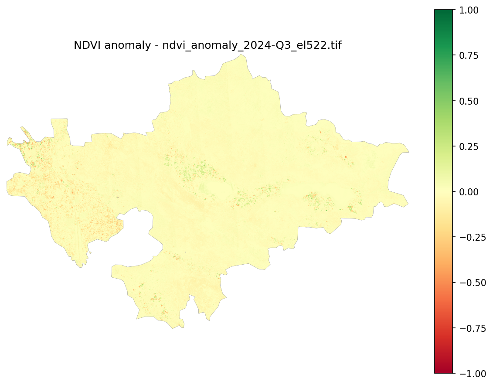

<h2>Pixel Feature Encoding (7D)</h2>

<ul>
<li><b>Trend slope</b></li>
<li><b>Seasonal variability</b></li>
<li><b>Minimum anomaly</b></li>
<li><b>Recovery ratio</b></li>
<li><b>Anomaly persistence</b></li>
<li><b>NDVI variance</b></li>
<li><b>NDVI skewness</b></li>
</ul>

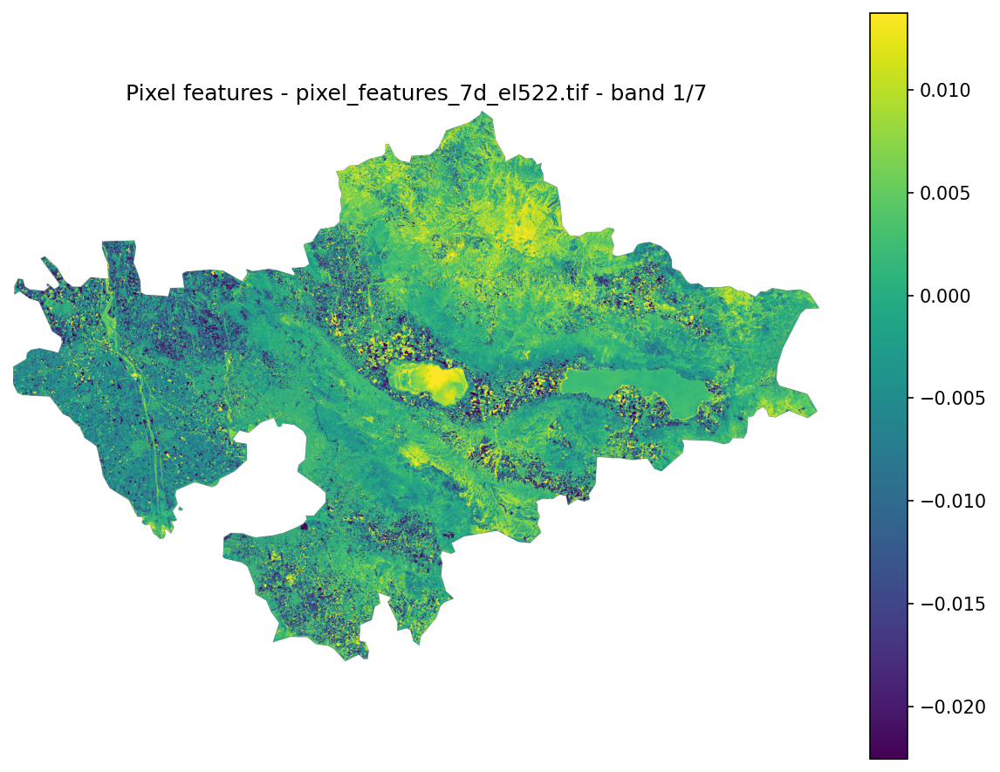
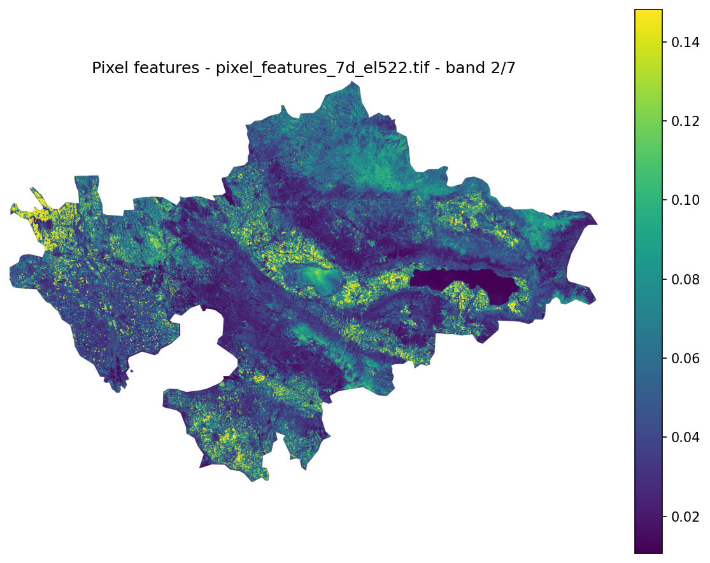
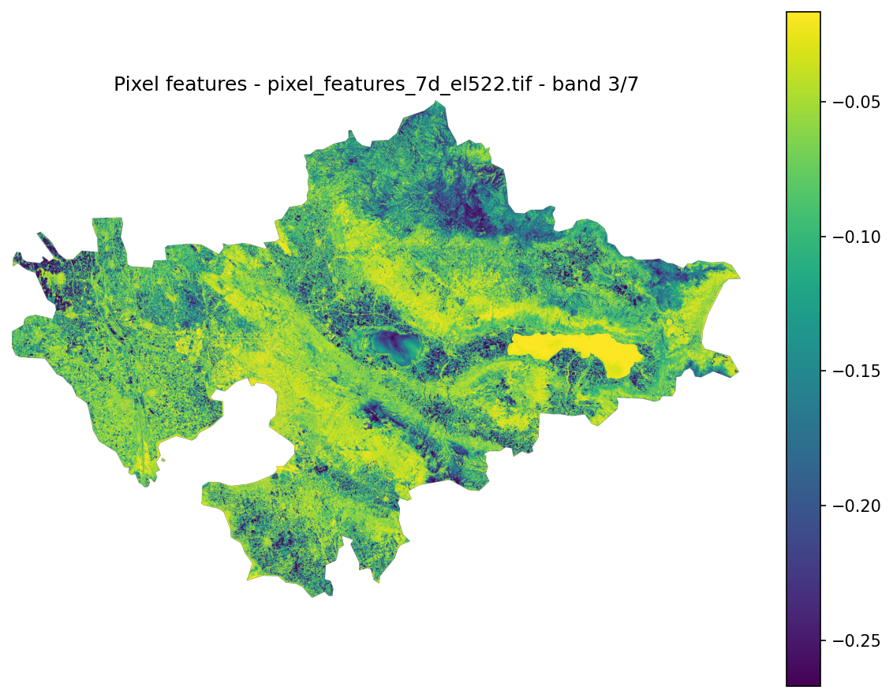
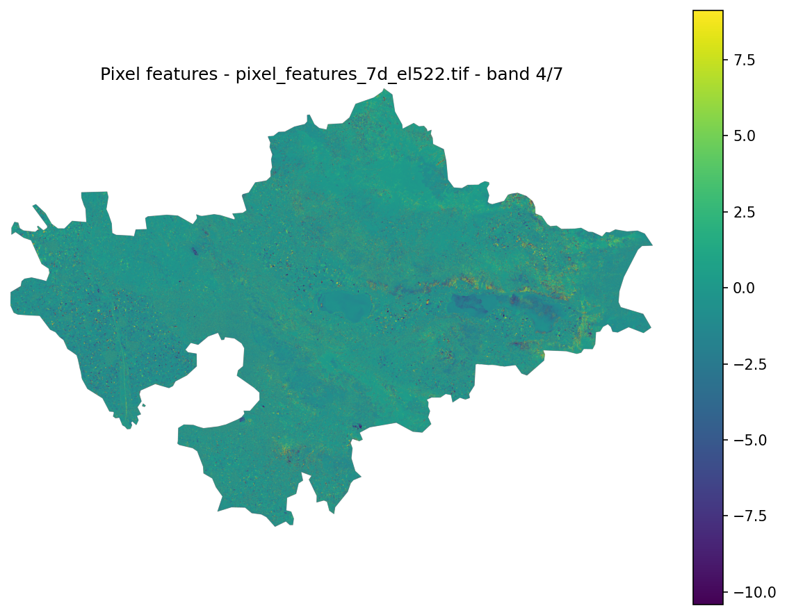
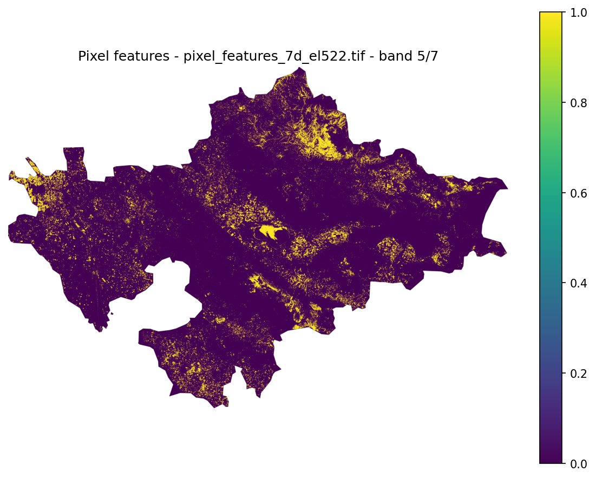
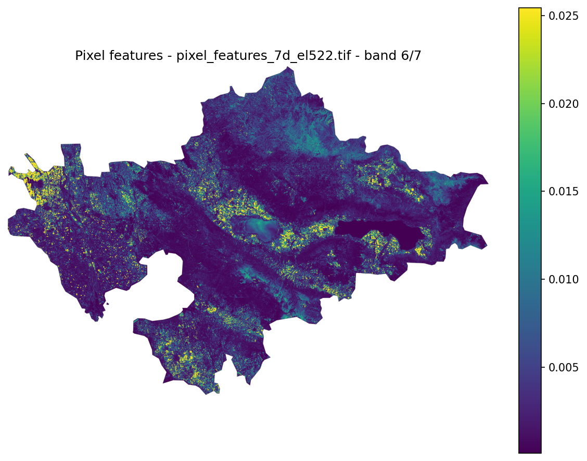
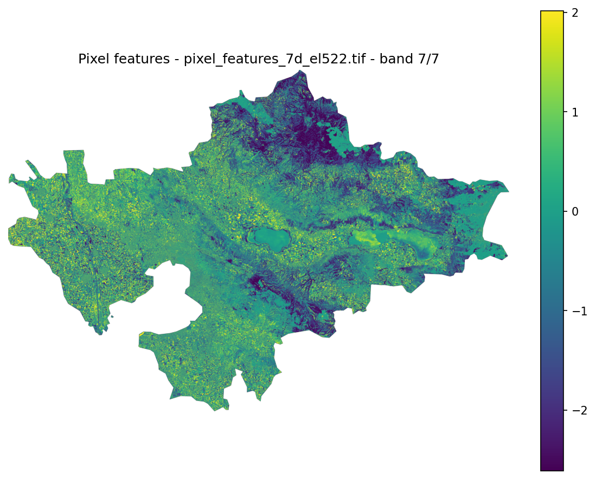

<h2>Repository Architecture</h2>

The repository is structured to separate algorithmic logic,
pipeline orchestration, and infrastructure components.

<pre>
src/thess_geo_analytics/

entrypoints/
pipelines/
builders/
geo/
services/
utils/
tools/
</pre>

<ul>
<li><b>entrypoints</b> — CLI entry scripts used by the Makefile</li>
<li><b>pipelines</b> — orchestration of processing stages</li>
<li><b>builders</b> — heavy raster transformations</li>
<li><b>geo</b> — core geospatial algorithms</li>
<li><b>services</b> — interaction with external APIs</li>
<li><b>utils</b> — shared helper utilities</li>
<li><b>tools</b> — debugging and visualization utilities</li>
</ul>

<h2>Technical Documentation (Wiki)</h2>

Detailed explanations of algorithms and design decisions are available in the Wiki.

<ul>
<li><a href="https://github.com/AlexRuedaPayen/thess-geo-analytics/wiki/AOI-Raster-Window">AOI Raster Window</a></li>
<li><a href="https://github.com/AlexRuedaPayen/thess-geo-analytics/wiki/Cloud-Masker">Cloud Masker</a></li>
<li><a href="https://github.com/AlexRuedaPayen/thess-geo-analytics/wiki/NDVI-Aggregated-Composite-Builder">NDVI Aggregated Composite Builder</a></li>
<li><a href="https://github.com/AlexRuedaPayen/thess-geo-analytics/wiki/Ndvi-Processor">NDVI Processor</a></li>
<li><a href="https://github.com/AlexRuedaPayen/thess-geo-analytics/wiki/Pipeline-Nvdi-Anomaly-Maps">NDVI Anomaly Pipeline</a></li>
<li><a href="https://github.com/AlexRuedaPayen/thess-geo-analytics/wiki/Pipeline-Pixel-Features">Pixel Feature Pipeline</a></li>
<li><a href="https://github.com/AlexRuedaPayen/thess-geo-analytics/wiki/Pixel-Feature-Extractor">Pixel Feature Extractor</a></li>
<li><a href="https://github.com/AlexRuedaPayen/thess-geo-analytics/wiki/Test-Whole-Pipeline-CI">Pixel Feature Extractor</a></li>
</ul>

<h2>Purpose of the Project</h2>

This repository demonstrates:

<ul>
<li>Earth Observation raster engineering</li>
<li>Sentinel-2 processing pipelines</li>
<li>geospatial data engineering</li>
<li>reproducible EO workflows</li>
</ul>

The goal is to build a <b>clean, deployable geospatial data pipeline</b>
capable of producing analysis-ready Earth Observation datasets
for temporal analysis and machine learning.

<h2> Licence </h2>

This project is licensed under the MIT License.
You are free to use it commercially, but must include attribution.

